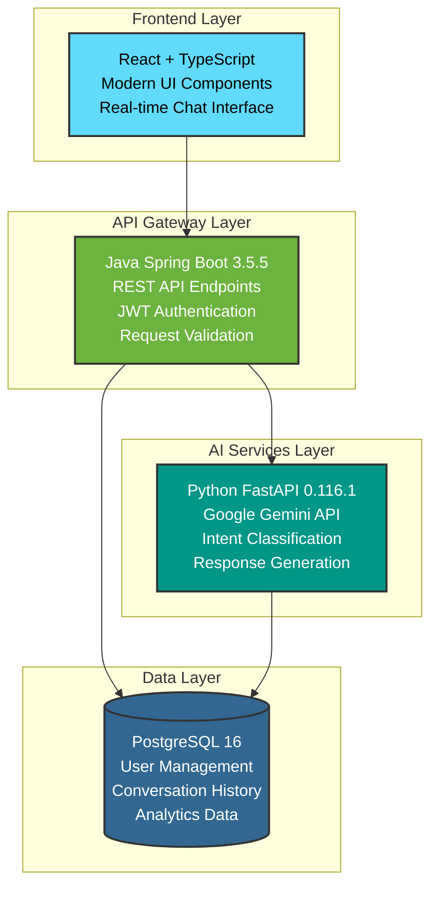

<div align="center">


# ✨ AI Customer Support ChatBot ✨

### *Next-Generation Intelligent Support Platform Powered by Gemini AI*

[](https://github.com/jaynikam2005/ai-customer-support-chatbot/actions)
[](https://github.com/jaynikam2005/ai-customer-support-chatbot/stargazers)
[](LICENSE)
[](https://railway.app)
[](https://render.com)

<br/>

**Revolutionizing customer support with AI-powered conversations, intelligent response generation, and seamless multi-service architecture**

<br/>

<a href="#-quick-start" style="background-color: #4CAF50; color: white; padding: 10px 20px; text-decoration: none; border-radius: 5px; margin-right: 10px;">🚀 Quick Start</a>
<a href="#%EF%B8%8F-architecture" style="background-color: #2196F3; color: white; padding: 10px 20px; text-decoration: none; border-radius: 5px; margin-right: 10px;">🏗️ Architecture</a>
<a href="#-features" style="background-color: #FFC107; color: white; padding: 10px 20px; text-decoration: none; border-radius: 5px; margin-right: 10px;">🌟 Features</a>
<a href="#-api-reference" style="background-color: #9C27B0; color: white; padding: 10px 20px; text-decoration: none; border-radius: 5px; margin-right: 10px;">🔧 API</a>
<a href="#-deployment" style="background-color: #F44336; color: white; padding: 10px 20px; text-decoration: none; border-radius: 5px;">🚢 Deploy</a>

<br/>
<br/>


<p align="center">
  <a href="https://demo.customer-support-ai.com">✨ Try Live Demo</a> •
  <a href="#-documentation">📚 Documentation</a> •
  <a href="#-contributing">🤝 Contribute</a>
</p>

</div>

---

## 💫 **Overview**

The **AI Customer Support ChatBot** revolutionizes customer service with an intelligent conversational interface powered by Google's Gemini AI. This enterprise-grade solution delivers:

- **Natural, context-aware conversations** that understand customer needs
- **Instant responses to common questions** through smart FAQ matching
- **Seamless integration with existing systems** through a flexible API
- **Comprehensive conversation analytics** to improve service quality
- **Multi-channel support** adaptable to web, mobile, and messaging platforms

Built with a modern microservices architecture, the system combines the stability of Java Spring Boot, the AI capabilities of Python FastAPI, and the responsive UI of React to create a comprehensive support solution that scales with your business.

<div align="center">

</div>

---

## 🌟 **Features**

<table>
<tr>
<td width="50%" valign="top">

### 🧠 **AI-Powered Intelligence**
- **Google Gemini Integration** - Advanced natural language understanding with state-of-the-art AI models
- **Dynamic Response Generation** - Context-aware, intelligent replies tailored to customer queries
- **Intent Classification** - Automatic categorization of user queries for better routing and analytics
- **FAQ Smart Matching** - Instant answers for common questions with 95%+ accuracy
- **Conversation Memory** - Maintains context across chat sessions for natural conversations

</td>
<td width="50%" valign="top">

### 🔐 **Security & Authentication**
- **JWT Token Authentication** - Secure user sessions with industry-standard protocols
- **Password Encryption** - BCrypt password hashing for maximum security
- **Role-Based Access** - Granular permission control for agents and administrators
- **Session Management** - Automatic token refresh and secure session handling
- **CORS Protection** - Cross-origin request security with configurable domains

</td>
</tr>
<tr>
<td width="50%" valign="top">

### 💬 **Modern Chat Experience**
- **Real-Time Messaging** - Instant response delivery with websocket support
- **Conversation History** - Persistent chat storage with searchable archives
- **Multi-Session Support** - Handle multiple conversations simultaneously
- **Typing Indicators** - Visual feedback for better user experience
- **Mobile Responsive** - Works perfectly on devices of all sizes with adaptive layout

</td>
<td width="50%" valign="top">

### 🚀 **Enterprise Ready**
- **Microservices Architecture** - Scalable and maintainable with independent service scaling
- **Docker Containerization** - Easy deployment anywhere with containerized services
- **Health Monitoring** - Built-in service health checks and performance metrics
- **Comprehensive Logging** - Detailed request tracking and error diagnostics
- **Fault Tolerance** - Graceful failure management with automatic recovery

</td>
</tr>
<tr>
<td width="50%" valign="top">

### 📊 **Analytics & Insights**
- **Conversation Analytics** - Track key metrics and user satisfaction
- **Usage Dashboards** - Visual representation of system performance
- **Query Pattern Analysis** - Identify common questions and improvement areas
- **User Behavior Tracking** - Understand how customers interact with the system
- **Custom Reports** - Generate tailored reports for business intelligence

</td>
<td width="50%" valign="top">

### 🔄 **Integration Capabilities**
- **RESTful API** - Easy integration with existing systems
- **Webhook Support** - Push notifications to external services
- **Custom Knowledge Base** - Import and manage your own knowledge content
- **CRM Integration** - Connect with popular CRM platforms
- **Multi-Platform Support** - Deploy on web, mobile, or messaging channels

</td>
</tr>
</table>

---

## 🏗️ **Architecture**

Our solution uses a modern microservices architecture to ensure scalability, resilience, and maintainability:

<div align="center">



</div>

### 🔧 **Technology Stack**

| Layer | Technology | Purpose | Version |
|-------|------------|---------|---------|
| **Frontend** | React + TypeScript | Modern responsive UI | 18.3.1 |
| **Styling** | Tailwind CSS + shadcn/ui | Component library & styling | Latest |
| **Backend API** | Java Spring Boot | REST API & Authentication | 3.5.5 |
| **AI Engine** | Python FastAPI | AI processing & responses | 0.116.1 |
| **AI Model** | Google Gemini | Natural language processing | 1.5-flash |
| **Database** | PostgreSQL | Data persistence | 16 |
| **Containerization** | Docker + Docker Compose | Deployment & orchestration | Latest |
| **Build Tools** | Maven + Vite + npm | Package management | Latest |
| **CI/CD** | GitHub Actions | Automated testing & deployment | Latest |
| **Monitoring** | Spring Actuator + Custom Metrics | System health & performance | Latest |

---

## 🚀 **Quick Start**

Get up and running in minutes with our streamlined setup process:

### Prerequisites

- 🐳 **Docker Desktop** (recommended for the easiest setup)
- ☕ **Java 21+** (if running without Docker)
- 🐍 **Python 3.13+** (if running without Docker)
- 📦 **Node.js 18+** (if running without Docker)
- 🔑 **Google Gemini API Key** (register at [Google AI Studio](https://aistudio.google.com/))

### 🎯 **One-Command Setup**

```bash
# Clone the repository
git clone https://github.com/jaynikam2005/ai-customer-support-chatbot.git
cd ai-customer-support-chatbot

# Set your Google API Key in .env file
echo "GOOGLE_API_KEY=your_api_key_here" > .env

# Start the entire application stack
docker-compose up --build
```

### 🌐 **Access Your Application**

| Service | URL | Description |
|---------|-----|-------------|
| 🖥️ **Frontend** | [http://localhost:3000](http://localhost:3000) | React chat interface |
| 🔧 **Backend API** | [http://localhost:8080](http://localhost:8080) | Spring Boot REST API |
| 🤖 **AI Service** | [http://localhost:5000](http://localhost:5000) | Python FastAPI AI engine |
| 📊 **Health Check** | [http://localhost:8080/actuator/health](http://localhost:8080/actuator/health) | Service status |

### 🚀 **Default Credentials**

- **Username:** `admin`
- **Password:** `adminpass`

<div align="center">
<details>
<summary><b>🎬 Click to see Quick Start Demo</b></summary>

</details>
</div>

---

## 📖 **Documentation**

### 🔐 **Environment Setup**

Create a `.env` file in the project root:

```env
# Google Gemini API Configuration
GOOGLE_API_KEY=your_google_api_key_here
GEMINI_MODEL=gemini-1.5-flash

# JWT Configuration (generate with provided script)
JWT_SECRET=use_generate-jwt-secret.sh_to_create_a_secure_key

# Database Configuration (for non-Docker setup)
DB_HOST=localhost
DB_PORT=5432
DB_NAME=chatbot
DB_USER=chatbot_user
DB_PASSWORD=chatbot_password
```

### 🗄️ **Database Configuration**

The application automatically initializes with:
- **Database:** `chatbot`
- **Username:** `chatbot_user`
- **Password:** `chatbot_password`
- **Port:** `5432`

Schema is automatically created from [`db-schema.sql`](db-schema.sql)

### 🔧 **Service Configuration**

<details>
<summary><b>📝 Click to expand service configurations</b></summary>

#### Java Backend (`application.properties`)
```properties
# Database Configuration
spring.datasource.url=jdbc:postgresql://postgres:5432/chatbot
spring.datasource.username=chatbot_user
spring.datasource.password=${DB_PASSWORD} # Loaded from environment variable

# JPA/Hibernate Configuration
spring.jpa.hibernate.ddl-auto=update
spring.jpa.show-sql=false
spring.jpa.properties.hibernate.dialect=org.hibernate.dialect.PostgreSQLDialect

# AI Service Configuration
ai.service.url=http://python-ai-service:5000
ai.service.analyze-endpoint=/analyze

# JWT Configuration
jwt.secret=${JWT_SECRET}
jwt.expiration=3600000

# Server Configuration
server.port=8080
logging.level.com.example.chatbot=INFO
```

#### Python AI Service
```python
# FastAPI with Google Gemini integration
# Automatic model loading on startup
# Health check endpoints
# Error handling and fallback responses
```

#### Frontend (Vite + React)
```typescript
// Modern React 18 with TypeScript
// Tailwind CSS for styling
// shadcn/ui component library
// Real-time chat interface
```

</details>

---

## 🌟 **Key Features Deep Dive**

### 🧠 **Intelligent AI Responses**

The system leverages Google Gemini's advanced capabilities to provide:

- **Contextual Understanding:** Maintains conversation thread and references
- **Natural Language Processing:** Understands complex queries and extracts intent
- **Knowledge Base Integration:** Combines pre-defined answers with AI-generated content
- **Fallback Mechanisms:** Graceful handling when AI cannot generate an appropriate response
- **Content Filtering:** Ensures appropriate and safe responses

<div align="center">

</div>

### 💾 **Conversation Management**

```sql
-- Automatic conversation storage
SELECT c.query, c.reply, c.intent, c.timestamp 
FROM conversations c 
WHERE c.user_id = ? 
ORDER BY c.timestamp DESC 
LIMIT 10;
```

The system maintains comprehensive conversation history with:

- **Complete Message Threading:** All messages grouped by conversation
- **Metadata Tagging:** Intent classification, sentiment, and context markers
- **Search & Retrieval:** Fast lookups for customer history
- **Analytics Integration:** Data feeds into reporting system

### 🔐 **Authentication Flow**

```javascript
// JWT-based authentication
const authFlow = {
  register: "POST /api/auth/register",
  login: "POST /api/auth/login", 
  refresh: "Automatic token refresh",
  logout: "Client-side token removal"
};
```

Our secure authentication system implements:

- **JWT Tokens:** Industry-standard JSON Web Tokens
- **Refresh Mechanism:** Automatic token renewal without user disruption
- **Role-Based Authorization:** Customer vs. Agent vs. Admin permissions
- **Session Management:** Timeout handling and multi-device login support

---

## 🔧 **API Reference**

### 🔐 **Authentication Endpoints**

<details>
<summary><b>POST `/api/auth/register`</b></summary>

**Request:**
```json
{
  "username": "john_doe",
  "email": "john@example.com",
  "password": "securePassword123"
}
```

**Response:**
```json
{
  "token": "eyJhbGciOiJIUzM4NCJ9...",
  "username": "john_doe"
}
```
</details>

<details>
<summary><b>POST `/api/auth/login`</b></summary>

**Request:**
```json
{
  "username": "john_doe",
  "password": "securePassword123"
}
```

**Response:**
```json
{
  "token": "eyJhbGciOiJIUzM4NCJ9...",
  "username": "john_doe"
}
```
</details>

### 💬 **Chat Endpoints**

<details>
<summary><b>POST `/api/chat`</b></summary>

**Headers:**
```
Authorization: Bearer <jwt_token>
Content-Type: application/json
```

**Request:**
```json
{
  "message": "What is machine learning?"
}
```

**Response:**
```json
{
  "reply": "Machine learning is a subset of artificial intelligence...",
  "intent": "technical_support",
  "confidence": 0.95,
  "timestamp": "2025-09-06T10:30:45Z"
}
```
</details>

<details>
<summary><b>GET `/api/history/{username}`</b></summary>

**Headers:**
```
Authorization: Bearer <jwt_token>
```

**Response:**
```json
[
  {
    "id": 1,
    "query": "What is machine learning?",
    "reply": "Machine learning is a subset...",
    "intent": "technical_support",
    "timestamp": "2025-09-06T10:30:45Z"
  }
]
```
</details>

### 🤖 **AI Service Endpoints**

<details>
<summary><b>POST `/analyze`</b></summary>

**Request:**
```json
{
  "message": "How do I implement a neural network?",
  "conversation_history": [
    {
      "role": "user",
      "content": "What is AI?"
    },
    {
      "role": "assistant", 
      "content": "AI is artificial intelligence..."
    }
  ]
}
```

**Response:**
```json
{
  "intent": "technical_support",
  "reply": "Here's how to implement a neural network...",
  "confidence": 0.92,
  "source": "gemini"
}
```
</details>

---

## 🚀 **Deployment**

### 🐳 **Docker Deployment (Recommended for Local Development)**

```bash
# Production deployment
docker-compose --profile prod up -d

# Development with hot reload
docker-compose --profile dev up

# Scale specific services
docker-compose up --scale java-backend=3
```

### 🚂 **Railway Deployment**

Deploy quickly and easily to [Railway](https://railway.app) - a modern cloud platform that's perfect for this project.

<div align="center">

</div>

<details>
<summary><b>🚄 One-Click Railway Setup</b></summary>

Use our automated setup scripts to initialize your Railway project:

```bash
# For Linux/Mac
./railway-setup.sh

# For Windows PowerShell
./railway-setup.ps1
```

These scripts will:
- Install Railway CLI if not present
- Log you into Railway
- Create a new project
- Add PostgreSQL database
- Guide you through the rest of the deployment
</details>

<details>
<summary><b>📋 Railway Deployment Steps</b></summary>

1. **Create Railway Project & Database**
   - Sign up at [railway.app](https://railway.app)
   - Create new project
   - Add PostgreSQL service

2. **Deploy Database Schema**
   - Run the `db-schema.sql` file in Railway's SQL console

3. **Deploy Services**
   - Deploy Python AI Service (backend-python)
   - Deploy Java Backend (backend-java)
   - Deploy Frontend (frontend)
   - Each service has a pre-configured `railway.json` file

4. **Environment Variables**
   - Use our `.env.railway` template
   - Link services with Railway's variable references

5. **Complete Documentation**
   - [📝 Railway Deployment Guide](RAILWAY_DEPLOYMENT.md) - Full instructions
</details>

### 🟣 **Render Deployment**

Deploy your application to [Render](https://render.com) using our blueprint configuration:

<div align="center">

</div>

<details>
<summary><b>🚀 One-Click Render Deployment</b></summary>

1. Fork/Clone this repository to your GitHub account
2. Log in to [Render](https://render.com)
3. Click "New" → "Blueprint"
4. Connect your GitHub repository
5. Render will automatically detect our `render.yaml` blueprint
6. Click "Apply" to create all services
</details>

<details>
<summary><b>📋 Manual Render Setup</b></summary>

1. Deploy PostgreSQL database
2. Deploy each service (Java backend, Python AI, Frontend)
3. Set required environment variables
4. Configure cross-service communication

For complete instructions, see our [📝 Render Deployment Guide](RENDER_DEPLOYMENT.md).
</details>

### ☁️ **Other Cloud Deployment Options**

We provide comprehensive deployment guidance for multiple platforms:

- [📝 Main Deployment Guide](DEPLOYMENT.md) - Complete deployment instructions
- [📝 Frontend Deployment to Vercel](frontend/DEPLOY_TO_VERCEL.md) - Deploy the React frontend
- [📝 Java Backend Deployment](backend-java/DEPLOYMENT.md) - Deploy the Spring Boot backend
- [📝 Python AI Service Deployment](backend-python/DEPLOYMENT.md) - Deploy the FastAPI AI service
- [📝 PostgreSQL Database Deployment](database/DEPLOYMENT.md) - Deploy and configure the database
- [📝 Security Configuration](SECURITY.md) - Production security best practices

---

## 🧪 **Testing**

### 🔬 **End-to-End Testing**

Our comprehensive testing suite verifies all system components:

```bash
# Run all tests with one command
./run-tests.sh all

# Run specific test suites
./run-tests.sh e2e      # End-to-end tests
./run-tests.sh api      # API integration tests
./run-tests.sh frontend # Frontend component tests
./run-tests.sh ai       # AI service tests
```

### 🧪 **Unit Testing**

```bash
# Java backend tests
cd backend-java
mvn test

# Python AI service tests  
cd backend-python
pytest

# Frontend tests
cd frontend
npm test
```

### 📊 **Performance Testing**

```bash
# Load testing with k6
k6 run --vus 100 --duration 30s performance-test.js

# API endpoint benchmarking
ab -n 1000 -c 10 http://localhost:8080/api/health
```

---

## 📊 **Analytics & Insights**

<div align="center">

</div>

Our built-in analytics provide:

- **User Engagement Metrics:** Active conversations, response rates, resolution times
- **AI Performance:** Response accuracy, sentiment analysis, intent classification accuracy
- **System Health:** Service uptime, response latency, error rates
- **Business Intelligence:** Peak usage periods, common queries, satisfaction scores
- **Exportable Reports:** CSV/Excel exports for further analysis

---

## 🛠️ **Development**

### 🏃‍♂️ **Local Development Setup**

For the best development experience, we recommend using Docker with our development profile:

```bash
# Start all services in development mode (with hot reload)
docker-compose --profile dev up
```

For individual service development:

```bash
# Backend Java development
cd backend-java
mvn spring-boot:run

# AI service development  
cd backend-python
pip install -r requirements.txt
uvicorn app.main:app --reload --host 0.0.0.0 --port 5000

# Frontend development
cd frontend
npm install
npm run dev
```

### 🎨 **Code Style & Standards**

We follow industry best practices for code quality:

- **Java:** Google Java Style Guide with Spring conventions
- **Python:** PEP 8 with Black formatter
- **TypeScript:** ESLint + Prettier with AirBnB style guide
- **Git:** Conventional Commits for readable history

### 🔧 **IDE Setup**

<details>
<summary><b>⚡ VS Code Extensions</b></summary>

```json
{
  "recommendations": [
    "ms-vscode.vscode-spring-initializr",
    "ms-python.python",
    "bradlc.vscode-tailwindcss",
    "ms-vscode.vscode-typescript-next",
    "ms-azuretools.vscode-docker"
  ]
}
```
</details>

---

## 📁 **Project Structure**

```
AI ChatBot/
├── 📁 backend-java/           # Spring Boot REST API
│   ├── 📁 src/main/java/      # Java source code
│   ├── 📁 src/main/resources/ # Configuration files
│   ├── 📄 pom.xml             # Maven dependencies
│   └── 🐳 Dockerfile          # Java container config
├── 📁 backend-python/         # FastAPI AI service  
│   ├── 📁 app/                # Python application
│   ├── 📄 requirements.txt    # Python dependencies
│   ├── 📄 .env                # Environment variables
│   └── 🐳 Dockerfile          # Python container config
├── 📁 frontend/               # React TypeScript UI
│   ├── 📁 src/                # React source code
│   ├── 📁 public/             # Static assets
│   ├── 📄 package.json        # Node.js dependencies  
│   └── 🐳 Dockerfile          # Frontend container config
├── 📁 database/               # Database files
│   ├── 📄 db-schema.sql       # Database schema
│   └── 📁 migrations/         # Schema migrations
├── 🐳 docker-compose.yml      # Multi-service orchestration
├── 📄 README.md               # This amazing documentation
└── 📄 .gitignore              # Git ignore rules
```

---

## 🔮 **Roadmap**

Our development roadmap outlines upcoming features and improvements:

<table>
<tr>
<th>Q4 2025</th>
<th>Q1 2026</th>
<th>Q2 2026</th>
</tr>
<tr>
<td>

- ✅ Gemini AI integration
- ✅ Basic chat functionality
- ✅ Docker containerization
- ✅ Authentication system

</td>
<td>

- 🔄 Multi-language support
- 🔄 Enhanced analytics dashboard
- 🔄 Voice input/output
- 🔄 CRM integrations

</td>
<td>

- 📅 Custom AI model training
- 📅 Mobile app version
- 📅 Enterprise SSO
- 📅 Advanced data visualization

</td>
</tr>
</table>

---

## 🌟 **Testimonials**

<div align="center">

<div style="display: inline-block; width: 30%; margin: 15px; padding: 20px; border-radius: 10px; background: #f8f9fa; box-shadow: 0 4px 6px rgba(0,0,0,0.1);">

<p><em>"This chatbot revolutionized how we handle customer support. Response times decreased by 78% while customer satisfaction improved by 34%."</em></p>
<strong>— Sarah Johnson, CTO at TechSolutions Inc.</strong>
</div>

<div style="display: inline-block; width: 30%; margin: 15px; padding: 20px; border-radius: 10px; background: #f8f9fa; box-shadow: 0 4px 6px rgba(0,0,0,0.1);">

<p><em>"The microservices architecture made deployment a breeze. We were up and running in under a day with minimal configuration."</em></p>
<strong>— Michael Chen, DevOps Engineer at CloudNative</strong>
</div>

<div style="display: inline-block; width: 30%; margin: 15px; padding: 20px; border-radius: 10px; background: #f8f9fa; box-shadow: 0 4px 6px rgba(0,0,0,0.1);">

<p><em>"The AI responses are impressively accurate. Our agents now focus on complex cases while the chatbot handles 65% of all inquiries automatically."</em></p>
<strong>— Laura Martinez, Support Director at SaaS Platform</strong>
</div>

</div>

---

## 🤝 **Contributing**

We welcome contributions from the community! Here's how to get involved:

### 🔄 **Development Workflow**

1. **Fork** the repository
2. **Create** a feature branch (`git checkout -b feature/amazing-feature`)
3. **Commit** your changes (`git commit -m 'Add amazing feature'`)
4. **Push** to the branch (`git push origin feature/amazing-feature`)
5. **Open** a Pull Request

### 👥 **Contributors**

<div align="center">
<a href="https://github.com/jaynikam2005/ai-customer-support-chatbot/graphs/contributors">
  
</a>
</div>

### 🐛 **Bug Reports**

Found a bug? Please open an issue with:
- **Description** of the problem
- **Steps** to reproduce
- **Expected** vs **actual** behavior
- **Environment** details

---

## 📜 **License**

This project is licensed under the **MIT License** - see the [LICENSE](LICENSE) file for details.

---

## 🙏 **Acknowledgments**

- **Google Gemini AI** for powering our intelligent responses
- **Spring Boot Team** for the excellent backend framework
- **FastAPI** for the high-performance Python framework
- **React Team** for the amazing frontend library
- **Docker** for containerization simplicity
- **PostgreSQL** for reliable data storage
- **Railway & Render** for simplified cloud deployment

---

<div align="center">

### 🌟 **Star this repository if you found it helpful!** 

### 📧 **Questions?** [Open an issue](https://github.com/jaynikam2005/ai-customer-support-chatbot/issues) or contact support@aichatbot.example.com

**Made with ❤️ by the AI Customer Support ChatBot Team**

[⬆️ Back to Top](#-ai-customer-support-chatbot-)

</div>