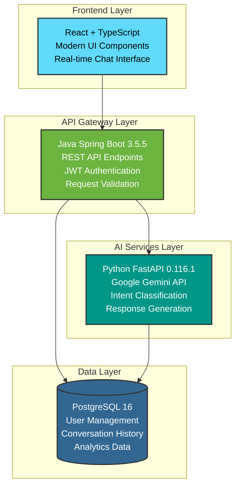

<div align="center">

# 🤖 AI Customer Support ChatBot

### *Next-Generation Intelligent Customer Support Platform*

[](https://github.com/yourusername/ai-chatbot)
[](https://docker.com)
[](LICENSE)
[](https://openjdk.org/)
[](https://python.org)
[](https://reactjs.org)
[](https://spring.io/projects/spring-boot)
[](https://fastapi.tiangolo.com)

*Revolutionizing customer support with AI-powered conversations, intelligent response generation, and seamless multi-service architecture.*

[🚀 Quick Start](#-quick-start) • [📖 Documentation](#-documentation) • [🏗️ Architecture](#%EF%B8%8F-architecture) • [🌟 Features](#-features) • [🔧 API Reference](#-api-reference)

</div>

---

## 🌟 **Features**

<table>
<tr>
<td width="50%">

### 🧠 **AI-Powered Intelligence**
- **Google Gemini Integration** - Advanced natural language understanding
- **Dynamic Response Generation** - Context-aware, intelligent replies
- **Intent Classification** - Automatic categorization of user queries
- **FAQ Smart Matching** - Instant answers for common questions
- **Conversation Memory** - Maintains context across chat sessions

</td>
<td width="50%">

### 🔐 **Security & Authentication**
- **JWT Token Authentication** - Secure user sessions
- **Password Encryption** - BCrypt password hashing
- **Role-Based Access** - Granular permission control
- **Session Management** - Automatic token refresh
- **CORS Protection** - Cross-origin request security

</td>
</tr>
<tr>
<td width="50%">

### 💬 **Modern Chat Experience**
- **Real-Time Messaging** - Instant response delivery
- **Conversation History** - Persistent chat storage
- **Multi-Session Support** - Handle multiple conversations
- **Typing Indicators** - Visual feedback for better UX
- **Mobile Responsive** - Works perfectly on all devices

</td>
<td width="50%">

### 🚀 **Enterprise Ready**
- **Microservices Architecture** - Scalable and maintainable
- **Docker Containerization** - Easy deployment anywhere
- **Health Monitoring** - Built-in service health checks
- **Logging & Analytics** - Comprehensive request tracking
- **Error Handling** - Graceful failure management

</td>
</tr>
</table>

---

## 🏗️ **Architecture**

<div align="center">



</div>

### 🔧 **Technology Stack**

| Layer | Technology | Purpose | Version |
|-------|------------|---------|---------|
| **Frontend** | React + TypeScript | Modern responsive UI | 18.3.1 |
| **Styling** | Tailwind CSS + shadcn/ui | Component library & styling | Latest |
| **Backend API** | Java Spring Boot | REST API & Authentication | 3.5.5 |
| **AI Engine** | Python FastAPI | AI processing & responses | 0.116.1 |
| **AI Model** | Google Gemini | Natural language processing | 1.5-flash |
| **Database** | PostgreSQL | Data persistence | 16 |
| **Containerization** | Docker + Docker Compose | Deployment & orchestration | Latest |
| **Build Tools** | Maven + Vite + npm | Package management | Latest |

---

## 🚀 **Quick Start**

### Prerequisites

- 🐳 **Docker Desktop** (recommended)
- ☕ **Java 21+** (if running without Docker)
- 🐍 **Python 3.13+** (if running without Docker)
- 📦 **Node.js 18+** (if running without Docker)

### 🎯 **One-Command Setup**

```bash
# Clone the repository
git clone https://github.com/yourusername/ai-customer-support-chatbot.git
cd ai-customer-support-chatbot

# Start the entire application stack
docker-compose up --build
```

### 🌐 **Access Your Application**

| Service | URL | Description |
|---------|-----|-------------|
| 🖥️ **Frontend** | [http://localhost:3000](http://localhost:3000) | React chat interface |
| 🔧 **Backend API** | [http://localhost:8080](http://localhost:8080) | Spring Boot REST API |
| 🤖 **AI Service** | [http://localhost:5000](http://localhost:5000) | Python FastAPI AI engine |
| 📊 **Health Check** | [http://localhost:8080/actuator/health](http://localhost:8080/actuator/health) | Service status |

---

## 📖 **Documentation**

### 🔐 **Environment Setup**

Create a `.env` file in the `backend-python` directory:

```env
# Google Gemini API Configuration
GOOGLE_API_KEY=your_google_api_key_here
GEMINI_MODEL=gemini-1.5-flash

# Python Configuration
PYTHONPATH=/workspace
PYTHONUNBUFFERED=1
```

### 🗄️ **Database Configuration**

The application automatically initializes with:
- **Database**: `chatbot`
- **Username**: `chatbot_user`
- **Password**: `chatbot_password`
- **Port**: `5432`

Schema is automatically created from [`db-schema.sql`](db-schema.sql)

### 🔧 **Service Configuration**

<details>
<summary><b>📝 Click to expand service configurations</b></summary>

#### Java Backend (`application.properties`)
```properties
# Database Configuration
spring.datasource.url=jdbc:postgresql://postgres:5432/chatbot
spring.datasource.username=chatbot_user
spring.datasource.password=chatbot_password

# JPA/Hibernate Configuration
spring.jpa.hibernate.ddl-auto=update
spring.jpa.show-sql=false
spring.jpa.properties.hibernate.dialect=org.hibernate.dialect.PostgreSQLDialect

# AI Service Configuration
ai.service.url=http://python-ai-service:5000
ai.service.analyze-endpoint=/analyze

# JWT Configuration
jwt.secret=your-256-bit-secret-key-here
jwt.expiration=3600000

# Server Configuration
server.port=8080
logging.level.com.example.chatbot=DEBUG
```

#### Python AI Service
```python
# FastAPI with Google Gemini integration
# Automatic model loading on startup
# Health check endpoints
# Error handling and fallback responses
```

#### Frontend (Vite + React)
```typescript
// Modern React 18 with TypeScript
// Tailwind CSS for styling
// shadcn/ui component library
// Real-time chat interface
```

</details>

---

## 🌟 **Key Features Deep Dive**

### 🧠 **Intelligent AI Responses**

```python
# Advanced Response Generation
- Context-aware conversations with memory
- Dynamic response length (500-2000 characters)
- Technical question detection and detailed code examples
- Fallback responses when AI service is unavailable
- Multi-turn conversation support
```

### 💾 **Conversation Management**

```sql
-- Automatic conversation storage
SELECT c.query, c.reply, c.intent, c.timestamp 
FROM conversations c 
WHERE c.user_id = ? 
ORDER BY c.timestamp DESC 
LIMIT 10;
```

### 🔐 **Authentication Flow**

```javascript
// JWT-based authentication
const authFlow = {
  register: "POST /api/auth/register",
  login: "POST /api/auth/login", 
  refresh: "Automatic token refresh",
  logout: "Client-side token removal"
};
```

---

## 🔧 **API Reference**

### 🔐 **Authentication Endpoints**

<details>
<summary><b>POST `/api/auth/register`</b></summary>

**Request:**
```json
{
  "username": "john_doe",
  "email": "john@example.com",
  "password": "securePassword123"
}
```

**Response:**
```json
{
  "token": "eyJhbGciOiJIUzM4NCJ9...",
  "username": "john_doe"
}
```
</details>

<details>
<summary><b>POST `/api/auth/login`</b></summary>

**Request:**
```json
{
  "username": "john_doe",
  "password": "securePassword123"
}
```

**Response:**
```json
{
  "token": "eyJhbGciOiJIUzM4NCJ9...",
  "username": "john_doe"
}
```
</details>

### 💬 **Chat Endpoints**

<details>
<summary><b>POST `/api/chat`</b></summary>

**Headers:**
```
Authorization: Bearer <jwt_token>
Content-Type: application/json
```

**Request:**
```json
{
  "message": "What is machine learning?"
}
```

**Response:**
```json
{
  "reply": "Machine learning is a subset of artificial intelligence...",
  "intent": "technical_support",
  "confidence": 0.95,
  "timestamp": "2025-09-06T10:30:45Z"
}
```
</details>

<details>
<summary><b>GET `/api/history/{username}`</b></summary>

**Headers:**
```
Authorization: Bearer <jwt_token>
```

**Response:**
```json
[
  {
    "id": 1,
    "query": "What is machine learning?",
    "reply": "Machine learning is a subset...",
    "intent": "technical_support",
    "timestamp": "2025-09-06T10:30:45Z"
  }
]
```
</details>

### 🤖 **AI Service Endpoints**

<details>
<summary><b>POST `/analyze`</b></summary>

**Request:**
```json
{
  "message": "How do I implement a neural network?",
  "conversation_history": [
    {
      "role": "user",
      "content": "What is AI?"
    },
    {
      "role": "assistant", 
      "content": "AI is artificial intelligence..."
    }
  ]
}
```

**Response:**
```json
{
  "intent": "technical_support",
  "reply": "Here's how to implement a neural network...",
  "confidence": 0.92,
  "source": "gemini"
}
```
</details>

---

## 🚀 **Deployment**

### 🐳 **Docker Deployment (Recommended)**

```bash
# Production deployment
docker-compose -f docker-compose.prod.yml up -d

# Development with hot reload
docker-compose up --build

# Scale specific services
docker-compose up --scale java-backend=3
```

### ☁️ **Cloud Deployment**

We provide detailed deployment guides for each component of the application:

- [📝 Frontend Deployment to Vercel](frontend/DEPLOY_TO_VERCEL.md) - Deploy the React frontend
- [📝 Java Backend Deployment](backend-java/DEPLOYMENT.md) - Deploy the Spring Boot backend
- [📝 Python AI Service Deployment](backend-python/DEPLOYMENT.md) - Deploy the FastAPI AI service
- [📝 PostgreSQL Database Deployment](database/DEPLOYMENT.md) - Deploy and configure the database
- [📝 CI/CD Workflow Setup](.github/CI_CD_SETUP.md) - Set up automated deployments

<details>
<summary><b>🔵 Azure Container Instances</b></summary>

```bash
# Deploy to Azure
az container create \
  --resource-group myResourceGroup \
  --name ai-chatbot \
  --image your-registry/ai-chatbot:latest \
  --ports 3000 8080 5000
```
</details>

<details>
<summary><b>🟡 AWS ECS</b></summary>

```json
{
  "family": "ai-chatbot",
  "networkMode": "awsvpc",
  "requiresCompatibilities": ["FARGATE"],
  "cpu": "1024",
  "memory": "2048"
}
```
</details>

<details>
<summary><b>🔵 Google Cloud Run</b></summary>

```bash
# Deploy to Cloud Run
gcloud run deploy ai-chatbot \
  --image gcr.io/PROJECT-ID/ai-chatbot \
  --platform managed \
  --region us-central1
```
</details>

---

## 🧪 **Testing**

### 🔬 **End-to-End Testing**

```powershell
# Run comprehensive E2E tests
./e2e-test.ps1

# Test frontend API integration
./test-frontend-api.ps1
```

### 🧪 **Unit Testing**

```bash
# Java backend tests
cd backend-java
mvn test

# Python AI service tests  
cd backend-python
pytest

# Frontend tests
cd frontend
npm test
```

### 📊 **Performance Testing**

```bash
# Load testing with k6
k6 run --vus 100 --duration 30s performance-test.js

# API endpoint benchmarking
ab -n 1000 -c 10 http://localhost:8080/api/health
```

---

## 🔍 **Monitoring & Observability**

### 📊 **Health Checks**

| Service | Endpoint | Status |
|---------|----------|--------|
| Frontend | `http://localhost:3000` | ✅ Healthy |
| Java Backend | `http://localhost:8080/actuator/health` | ✅ Healthy |
| AI Service | `http://localhost:5000/health` | ✅ Healthy |
| Database | `postgresql://localhost:5432` | ✅ Connected |

### 📈 **Metrics & Logging**

```bash
# View service logs
docker-compose logs -f java-backend
docker-compose logs -f python-ai-service
docker-compose logs -f frontend

# Monitor resource usage
docker stats
```

---

## 🛠️ **Development**

### 🏃‍♂️ **Local Development Setup**

```bash
# Backend Java development
cd backend-java
mvn spring-boot:run

# AI service development  
cd backend-python
pip install -r requirements.txt
uvicorn app.main:app --reload --host 0.0.0.0 --port 5000

# Frontend development
cd frontend
npm install
npm run dev
```

### 🎨 **Code Style & Standards**

- **Java**: Google Java Style Guide
- **Python**: PEP 8 with Black formatter
- **TypeScript**: ESLint + Prettier
- **Git**: Conventional Commits

### 🔧 **IDE Setup**

<details>
<summary><b>⚡ VS Code Extensions</b></summary>

```json
{
  "recommendations": [
    "ms-vscode.vscode-spring-initializr",
    "ms-python.python",
    "bradlc.vscode-tailwindcss",
    "ms-vscode.vscode-typescript-next",
    "ms-azuretools.vscode-docker"
  ]
}
```
</details>

---

## 📁 **Project Structure**

```
AI ChatBot/
├── 📁 backend-java/           # Spring Boot REST API
│   ├── 📁 src/main/java/      # Java source code
│   ├── 📁 src/main/resources/ # Configuration files
│   ├── 📄 pom.xml             # Maven dependencies
│   └── 🐳 Dockerfile          # Java container config
├── 📁 backend-python/         # FastAPI AI service  
│   ├── 📁 app/                # Python application
│   ├── 📄 requirements.txt    # Python dependencies
│   ├── 📄 .env                # Environment variables
│   └── 🐳 Dockerfile          # Python container config
├── 📁 frontend/               # React TypeScript UI
│   ├── 📁 src/                # React source code
│   ├── 📁 public/             # Static assets
│   ├── 📄 package.json        # Node.js dependencies  
│   └── 🐳 Dockerfile          # Frontend container config
├── 📁 database/               # Database files
│   ├── 📄 db-schema.sql       # Database schema
│   └── 📁 migrations/         # Schema migrations
├── 🐳 docker-compose.yml      # Multi-service orchestration
├── 📄 README.md               # This amazing documentation
└── 📄 .gitignore              # Git ignore rules
```

---

## 🤝 **Contributing**

We welcome contributions! Please see our [Contributing Guide](CONTRIBUTING.md) for details.

### 🔄 **Development Workflow**

1. **Fork** the repository
2. **Create** a feature branch (`git checkout -b feature/amazing-feature`)
3. **Commit** your changes (`git commit -m 'Add amazing feature'`)
4. **Push** to the branch (`git push origin feature/amazing-feature`)
5. **Open** a Pull Request

### 🐛 **Bug Reports**

Found a bug? Please open an issue with:
- **Description** of the problem
- **Steps** to reproduce
- **Expected** vs **actual** behavior
- **Environment** details

---

## 📜 **License**

This project is licensed under the **MIT License** - see the [LICENSE](LICENSE) file for details.

---

## 🙏 **Acknowledgments**

- **Google Gemini AI** for powering our intelligent responses
- **Spring Boot Team** for the excellent framework
- **FastAPI** for the high-performance async API framework
- **React Team** for the amazing frontend library
- **Docker** for containerization simplicity
- **PostgreSQL** for reliable data storage

---

<div align="center">

### 🌟 **Star this repository if you found it helpful!** 

### 📧 **Questions?** [Open an issue](https://github.com/yourusername/ai-chatbot/issues) or [contact us](mailto:support@example.com)

**Made with ❤️ by the AI ChatBot Team**

[⬆️ Back to Top](#-ai-customer-support-chatbot)

</div>
