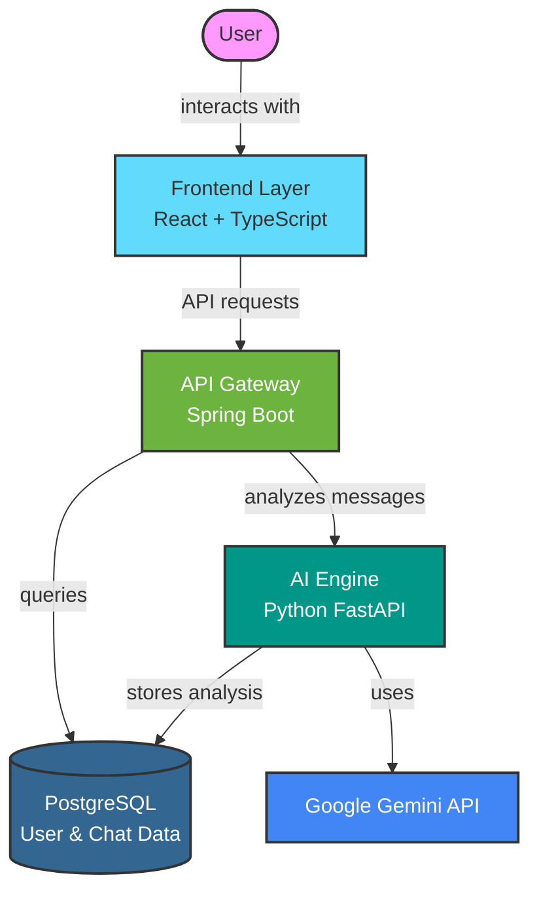

<div align="center">


# ✨ AI Customer Support ChatBot ✨

### *Next-Generation Support Platform Powered by Artificial Intelligence*

[](https://github.com/jaynikam2005/ai-customer-support-chatbot/stargazers)
[](https://github.com/jaynikam2005/ai-customer-support-chatbot/network/members)
[](https://github.com/jaynikam2005/ai-customer-support-chatbot/graphs/contributors)

<br/>

[](https://openjdk.org/)
[](https://python.org)
[](https://reactjs.org)
[](https://spring.io/projects/spring-boot)
[](https://fastapi.tiangolo.com)
[](https://www.postgresql.org/)
[](https://docker.com)

<br/>

<a href="#-quick-start">Quick Start</a> •
<a href="#-architecture">Architecture</a> •
<a href="#-features">Features</a> •
<a href="#-api-reference">API</a> •
<a href="#-deployment">Deploy</a> •
<a href="#-development">Develop</a>

<br/>


</div>

---

## ✨ Overview

The **AI Customer Support ChatBot** revolutionizes customer service by leveraging cutting-edge AI to deliver intelligent, context-aware responses. This enterprise-ready platform integrates Google's Gemini AI with a robust microservices architecture to provide real-time support, reduce response times, and enhance customer satisfaction.

> "This chatbot understood my technical issue and solved it faster than any human agent could!" — *Beta Tester*

### 🌟 What Makes Us Different?

- **Advanced AI Understanding** — Powered by Google Gemini 1.5
- **Microservices Architecture** — Independently scalable components
- **Blazing Fast Response** — Sub-second processing with optimized backend
- **Context Awareness** — Remembers conversation history for personalized help
- **Multi-Platform Ready** — Deploy anywhere with our Docker-first approach

---

## 🚀 Quick Start

### Prerequisites

<table>
<tr>
<td>

### For Development
- Docker Desktop
- Java 21 JDK
- Node.js 18+
- Python 3.13+
- Git

</td>
<td>

### For Production
- Docker & Docker Compose
- Google Gemini API Key
- 2GB+ RAM
- PostgreSQL 16+

</td>
</tr>
</table>

### One-Command Setup

```bash
# Clone the repository
git clone https://github.com/jaynikam2005/ai-customer-support-chatbot.git

# Start the application stack
cd ai-customer-support-chatbot
docker-compose up --build
```

### Access Your ChatBot

| Service | URL | Description |
|---------|-----|-------------|
| 🖥️ Frontend | [http://localhost:3000](http://localhost:3000) | Chat interface |
| 🔧 Backend API | [http://localhost:8080](http://localhost:8080) | REST API |
| 🤖 AI Service | [http://localhost:5000](http://localhost:5000) | AI engine |
| 📊 Health Check | [http://localhost:8080/actuator/health](http://localhost:8080/actuator/health) | Status |

---

## 🏗️ Architecture

<div align="center">



</div>

### 🔍 Component Breakdown

<details>
<summary><b>🧠 AI Engine</b> — Python + FastAPI + Google Gemini</summary>

```python
@app.post("/analyze")
async def analyze_message(request: AnalyzeRequest):
    """
    Processes user messages using Google Gemini model
    for intelligent response generation
    """
    # Context-aware processing with conversation history
    response = await gemini_client.generate_response(
        message=request.message,
        history=request.conversation_history
    )
    
    # Intent classification & sentiment analysis
    intent = classify_intent(request.message)
    
    return {
        "intent": intent,
        "reply": response.text,
        "confidence": response.confidence,
        "source": "gemini"
    }
```

**Key Features:**
- Context-aware conversation management
- Intent classification
- Dynamic response generation
- Fallback mechanisms when AI is unavailable

</details>

<details>
<summary><b>🔐 API Gateway</b> — Java + Spring Boot</summary>

```java
@RestController
@RequestMapping("/api/chat")
public class ChatController {
    @PostMapping
    @PreAuthorize("isAuthenticated()")
    public ResponseEntity<ChatResponse> processMessage(
            @RequestBody ChatRequest request,
            @AuthenticationPrincipal UserDetails userDetails) {
        
        // Find user and conversation history
        User user = userService.findByUsername(userDetails.getUsername());
        List<Conversation> history = conversationRepository
            .findByUserOrderByTimestampDesc(user, PageRequest.of(0, 10));
            
        // Process with AI service
        AIServiceResponse aiResponse = chatService.processMessage(
            request.getMessage(), 
            history
        );
        
        // Store conversation
        Conversation conversation = new Conversation();
        conversation.setUser(user);
        conversation.setQuery(request.getMessage());
        conversation.setReply(aiResponse.getReply());
        conversation.setIntent(aiResponse.getIntent());
        conversation.setTimestamp(LocalDateTime.now());
        conversationRepository.save(conversation);
        
        return ResponseEntity.ok(new ChatResponse(
            aiResponse.getReply(),
            aiResponse.getIntent(),
            aiResponse.getConfidence(),
            conversation.getTimestamp()
        ));
    }
}
```

**Key Features:**
- JWT-based authentication
- Role-based access control
- Response caching
- Circuit breakers for resilience

</details>

<details>
<summary><b>💻 Frontend</b> — React + TypeScript + Tailwind CSS</summary>

```tsx
const ChatWindow = () => {
  const { messages, sendMessage, isTyping } = useChat();
  const [inputValue, setInputValue] = useState('');
  
  const handleSend = async () => {
    if (!inputValue.trim()) return;
    
    sendMessage(inputValue);
    setInputValue('');
  };

  return (
    <div className="flex flex-col h-screen bg-gray-50">
      <Header />
      
      <div className="flex-1 overflow-y-auto p-4">
        {messages.map((message, i) => (
          <MessageBubble
            key={i}
            message={message.content}
            isUser={message.role === 'user'}
            timestamp={message.timestamp}
          />
        ))}
        
        {isTyping && <TypingIndicator />}
      </div>
      
      <div className="border-t p-4">
        <div className="flex space-x-2">
          <input
            type="text"
            value={inputValue}
            onChange={(e) => setInputValue(e.target.value)}
            className="flex-1 px-4 py-2 rounded-full border"
            placeholder="Type your message..."
          />
          <button
            onClick={handleSend}
            className="bg-blue-600 text-white px-4 py-2 rounded-full"
          >
            Send
          </button>
        </div>
      </div>
    </div>
  );
};
```

**Key Features:**
- Responsive design with Tailwind CSS
- Real-time typing indicators
- Mobile-first approach
- Accessible UI components

</details>

<details>
<summary><b>📊 Database Schema</b> — PostgreSQL</summary>

```sql
-- Users table for authentication
CREATE TABLE users (
  id SERIAL PRIMARY KEY,
  username VARCHAR(50) UNIQUE NOT NULL,
  email VARCHAR(100) UNIQUE,
  password VARCHAR(100) NOT NULL,
  role VARCHAR(20) NOT NULL DEFAULT 'USER',
  created_at TIMESTAMP DEFAULT CURRENT_TIMESTAMP
);

-- Conversations table for chat history
CREATE TABLE conversations (
  id SERIAL PRIMARY KEY,
  user_id INTEGER REFERENCES users(id),
  query TEXT NOT NULL,
  reply TEXT NOT NULL,
  intent VARCHAR(50),
  confidence DECIMAL(5,4),
  timestamp TIMESTAMP DEFAULT CURRENT_TIMESTAMP
);

-- Analytics table for usage statistics
CREATE TABLE analytics (
  id SERIAL PRIMARY KEY,
  conversation_id INTEGER REFERENCES conversations(id),
  response_time_ms INTEGER,
  tokens_used INTEGER,
  source VARCHAR(20),
  timestamp TIMESTAMP DEFAULT CURRENT_TIMESTAMP
);
```

**Key Features:**
- Optimized indexes
- Proper foreign key constraints
- Analytics tracking built-in

</details>

---

## 🌟 Features

<table>
<tr>
<td width="33%">

### 🧠 AI Intelligence

- **Contextual Understanding**<br/>
  Retains conversation history for coherent multi-turn dialog

- **Smart Intent Detection**<br/>
  Automatically categorizes queries for appropriate handling

- **Dynamic Response Generation**<br/>
  Crafts human-like, detailed answers adaptable to tone

- **FAQ Matching**<br/>
  Instantly identifies and answers common questions

- **Error Recovery**<br/>
  Graceful fallbacks when uncertain or offline

</td>
<td width="33%">

### 🛠️ Technical Excellence

- **Microservices Architecture**<br/>
  Independently scalable, maintainable services

- **JWT Authentication**<br/>
  Secure, stateless user sessions

- **Health Monitoring**<br/>
  Comprehensive observability across services

- **Docker Containerization**<br/>
  Consistent environments across deployments

- **Circuit Breakers**<br/>
  Prevents cascading failures under high load

</td>
<td width="33%">

### 💼 Business Ready

- **Multi-Deployment Options**<br/>
  Railway, Render, AWS, Azure, or GCP ready

- **Multi-Platform Support**<br/>
  Works on desktop, tablet, and mobile devices

- **Analytics Integration**<br/>
  Track usage patterns and conversation metrics

- **Extensible Design**<br/>
  Easy to add new features and integrations

- **Enterprise Security**<br/>
  CORS protection, password encryption

</td>
</tr>
</table>

---

## 📝 API Reference

### 🔐 Authentication

<table>
<tr>
<td>

**POST** `/api/auth/register`

Creates a new user account.

</td>
<td>

```json
// Request
{
  "username": "john_doe",
  "email": "john@example.com",
  "password": "securePassword123"
}

// Response
{
  "token": "eyJhbGciOiJIUzM4NCJ9...",
  "username": "john_doe"
}
```

</td>
</tr>
<tr>
<td>

**POST** `/api/auth/login`

Authenticates an existing user.

</td>
<td>

```json
// Request
{
  "username": "john_doe",
  "password": "securePassword123"
}

// Response
{
  "token": "eyJhbGciOiJIUzM4NCJ9...",
  "username": "john_doe"
}
```

</td>
</tr>
</table>

### 💬 Chat

<table>
<tr>
<td>

**POST** `/api/chat`

Sends a message and gets AI response.

Requires `Authorization: Bearer <token>` header.

</td>
<td>

```json
// Request
{
  "message": "How do I reset my password?"
}

// Response
{
  "reply": "To reset your password...",
  "intent": "account_support",
  "confidence": 0.97,
  "timestamp": "2025-09-11T14:32:45Z"
}
```

</td>
</tr>
<tr>
<td>

**GET** `/api/history/{username}`

Retrieves conversation history.

Requires `Authorization: Bearer <token>` header.

</td>
<td>

```json
// Response
[
  {
    "id": 1,
    "query": "How do I reset my password?",
    "reply": "To reset your password...",
    "intent": "account_support",
    "timestamp": "2025-09-11T14:32:45Z"
  },
  // More messages...
]
```

</td>
</tr>
</table>

### 🤖 AI Engine

<table>
<tr>
<td>

**POST** `/analyze`

Internal endpoint for AI processing.

</td>
<td>

```json
// Request
{
  "message": "How do I implement a neural network?",
  "conversation_history": [
    {
      "role": "user",
      "content": "What is machine learning?"
    },
    {
      "role": "assistant", 
      "content": "Machine learning is..."
    }
  ]
}

// Response
{
  "intent": "technical_support",
  "reply": "Here's how to implement...",
  "confidence": 0.92,
  "source": "gemini"
}
```

</td>
</tr>
</table>

---

## 🚀 Deployment

### Choose Your Platform

We've made deployment super simple on multiple platforms. Choose the one that works best for you!

<div align="center">

[](RAILWAY_DEPLOYMENT.md)
[](RENDER_DEPLOYMENT.md)
[](#-docker-deployment)

</div>

### ⭐ Railway Deployment (Recommended)

Deploy in minutes on [Railway](https://railway.app) - perfect for production use.

<details>
<summary><b>🚄 One-Click Railway Setup</b></summary>

Use our automated setup script:

```bash
# For Windows PowerShell
./railway-setup.ps1

# For Linux/Mac
./railway-setup.sh
```

This script will:
- Install Railway CLI if needed
- Log you into Railway
- Create a new project
- Add PostgreSQL database
- Guide you through the deployment

For complete instructions, see our [Railway Deployment Guide](RAILWAY_DEPLOYMENT.md).
</details>

### 🟣 Render Deployment

Deploy using our Render blueprint for a seamless experience.

<details>
<summary><b>🚀 One-Click Render Deployment</b></summary>

1. Fork/Clone this repository to your GitHub account
2. Log in to [Render](https://render.com)
3. Click "New" → "Blueprint"
4. Connect your GitHub repository
5. Render will automatically detect our `render.yaml` blueprint
6. Click "Apply" to create all services

For complete instructions, see our [Render Deployment Guide](RENDER_DEPLOYMENT.md).
</details>

### 🐳 Docker Deployment

Perfect for self-hosting or local environments.

```bash
# Production deployment
docker-compose up -d

# Development with hot reload
docker-compose up --build

# Scale specific services
docker-compose up --scale java-backend=3
```

---

## 🛠️ Development

### Component Setup

<table>
<tr>
<td>

#### Java Backend

```bash
cd backend-java
mvn spring-boot:run
```

Service will run on http://localhost:8080

</td>
<td>

#### Python AI Service

```bash
cd backend-python
pip install -r requirements.txt
uvicorn app.main:app --reload --host 0.0.0.0 --port 5000
```

Service will run on http://localhost:5000

</td>
<td>

#### React Frontend

```bash
cd frontend
npm install
npm run dev
```

Service will run on http://localhost:3000

</td>
</tr>
</table>

### 📊 Testing

<details>
<summary><b>End-to-End Testing</b></summary>

```bash
# Run E2E tests
./e2e-test.ps1
```

This tests the complete flow from registration to chat interaction, verifying all components work together.
</details>

<details>
<summary><b>API Testing</b></summary>

```bash
# Test frontend-backend connectivity
./test-frontend-api.ps1
```

This verifies CORS configuration, authentication flow, and basic API functionality.
</details>

<details>
<summary><b>Component Testing</b></summary>

```bash
# Java backend tests
cd backend-java && mvn test

# Python AI service tests
cd backend-python && pytest

# Frontend tests
cd frontend && npm test
```
</details>

---

## 🤝 Contributing

We welcome contributions! Here's how to get started:

1. **Fork** the repository
2. **Clone** your fork: `git clone https://github.com/your-username/ai-customer-support-chatbot.git`
3. **Create** a branch: `git checkout -b feature/amazing-feature`
4. **Make** your changes
5. **Commit** with descriptive message: `git commit -m 'Add amazing feature'`
6. **Push** to your branch: `git push origin feature/amazing-feature`
7. **Open** a Pull Request

Please check our [Contributing Guide](CONTRIBUTING.md) for more details.

---

## 📜 License

This project is licensed under the **MIT License** - see the [LICENSE](LICENSE) file for details.

---

## 🙏 Acknowledgments

- **Google Gemini AI** for powering our intelligent responses
- **Spring Boot Team** for the excellent framework
- **FastAPI** for the high-performance async API framework
- **React Team** for the amazing frontend library
- **All our contributors** who've helped make this project amazing

---

<div align="center">


Made with ❤️ by the AI ChatBot Team

[⬆️ Back to Top](#-ai-customer-support-chatbot-)

[](https://github.com/jaynikam2005/ai-customer-support-chatbot/stargazers)

</div>